# Go-image

## Introduction

This go package has been created to do image processing with golang. I'm currently working to improve it (parallels proccesses, etc). In all exemple, the default image is :

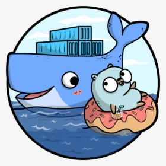

## Table of Content

1. [Effects](#effects)
    - [Grayscale](#grayscale)
    - [Threshold](#threshold)
    - [Invert](#invert)
    - [Sobel Edge detection](#sobal-edge-detection)
    - [Gaussian Blur](#gaussian-blur)

2. [Filter](#filter)
    - [Color Filter](#color-filter)
    - [Simple Filter](#simple-filter)

3. [Licence](#licence)

## Effects

### Grayscale

You can transform a picture in grayscale with the Grayscale function.

```golang
newImg := effects.Grayscale(img)
```

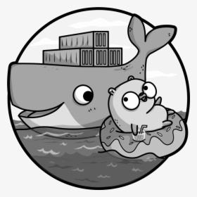

By default the Grayscale transformation uses the ITU-R recomandation but you can modify it. For exemple :

```golang
newImg := effects.Grayscale(img, 0.2, 0.5, 0.3)
```

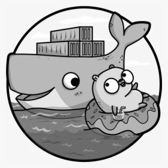

Please when you use your own config, make sure to use all three parameters and make sure that the sum is equal to one.

### Threshold

You can threshold a picture. It means you fix a gray level and every pixel under that gray level will be black. Others will be white.

```golang
newImg := effects.Threshold(img, 0) // It will render a fully white image
```


Here is an exemple of a half Threshold :

```golang
newImg := effects.Threshold(img, 187) // It will render a half Threshold image
```

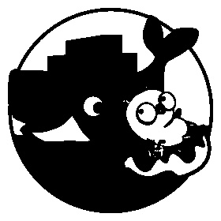

### Invert

You can invert an RGBA image.

```golang
newImg := effects.Invert(img)
```

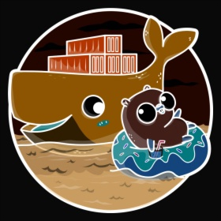

You can also select a square to invert inside the image with the config array :

```golang
newImg := effects.Invert(img, 0, 200, 0, 200) // It will invert top left square of 3x3 pixels if the image size is large enough
```

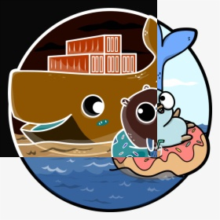

### Sobal Edge detection

You can use the Sobal edge detection method.

```golang
newImg := effects.SobalEdge(img)
```

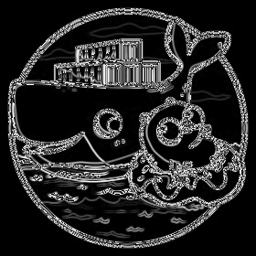

### Gaussian Blur

You can blur an image. You can choose the blur radius. The bigger the blur radius, the more blur the picture will be.

```golang
newImg := effects.GaussianBlur(img, 10)
```


### Brightness

You can adjust picture brightness. You can lower it's level or raise it.

```golang
newImg := effects.Brightness(img, 85)
```

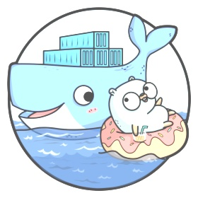
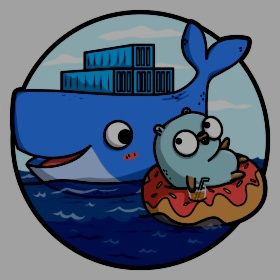

## Filter

### Color filter

You can filter a specific color on an image. It will render only "close" colors and the others will be grayscaled.

```golang
f := filter.Filter{Color: &color.RGBA{255, 0, 0, 255}}

newImg := f.ColorFilter(img, 6.15)
```

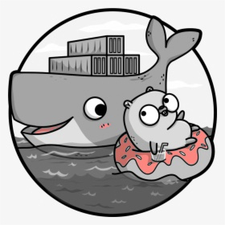

### Simple filter

You can apply simple filters on images.

```golang
f := filter.Filter{Color: &color.RGBA{255, 0, 0, 255}}

newImg := f.Apply(img)
```

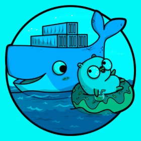
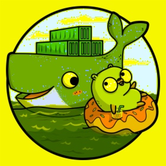
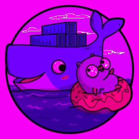

## Licence

This project is licensed under the MIT license. Please read the LICENSE file.
