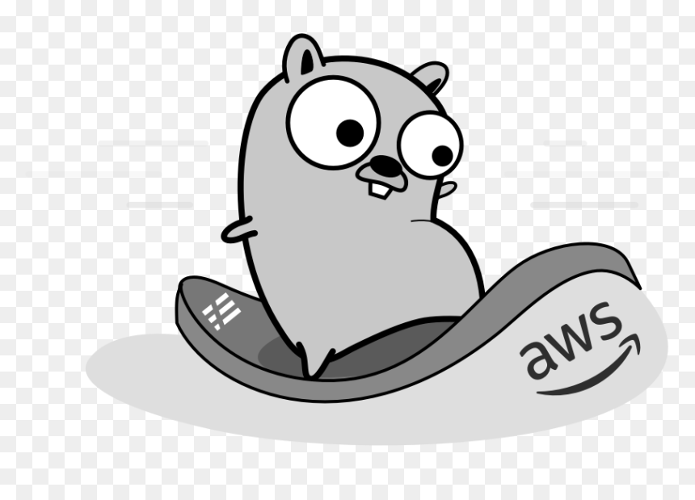
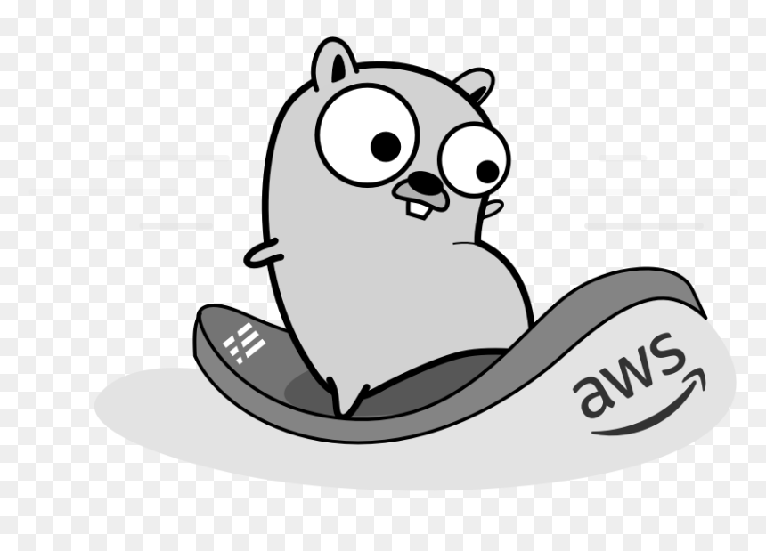
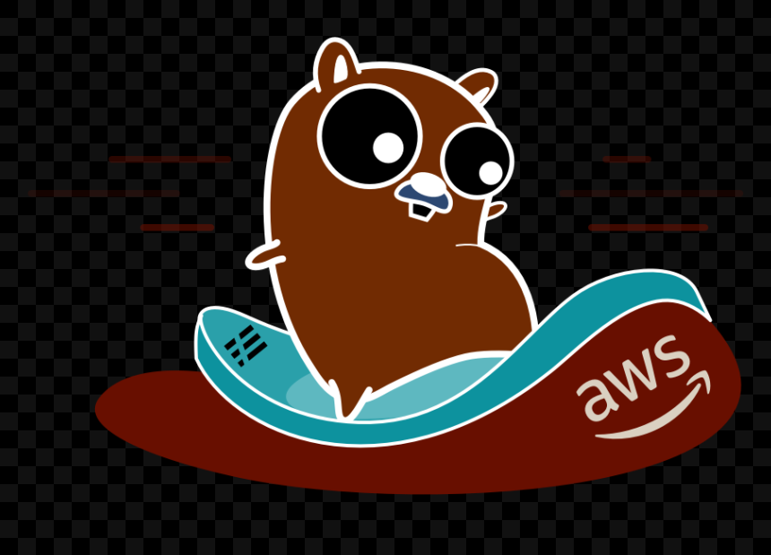
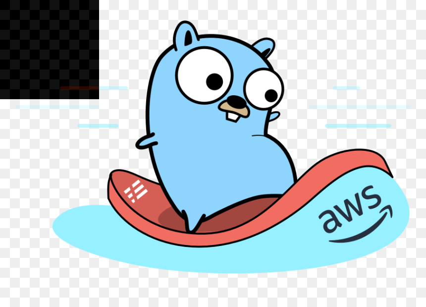

# Go-image

## Introduction

This go package has been created to do image processing with golang. I'm currently working to improve it (parallels proccesses, etc).

## Table of Content

## Effects

### Grayscale

You can transform a picture in grayscale with the Grayscale function.

```golang
newImg := effects.Grayscale(img)
```



By default the Grayscale transformation uses the ITU-R recomandation but you can modify it. For exemple :

```golang
newImg := effects.Grayscale(img, 0.2, 0.5, 0.3)
```



Please when you use your own config, make sure to use all three parameters and make sure that the sum is equal to one.

### Threshold

You can threshold a picture. It means you fix a gray level and every pixel under that gray level will be black. Others will be white.

```golang
newImg := effects.Threshold(img, 0) // It will render a fully white image
```


### Invert

You can invert an RGBA image.

```golang
newImg := effects.Invert(img)
```



You can also select a square to invert inside the image with the config array :

```golang
newImg := effects.Invert(img, 0, 200, 0, 200) // It will invert top left square of 3x3 pixels if the image size is large enough
```



## Licence

This project is licensed under the MIT license. Please read the LICENSE file.
